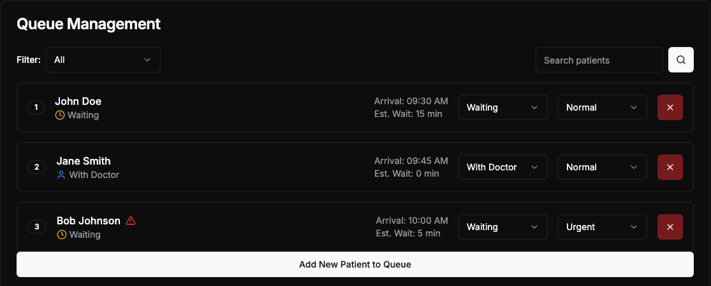
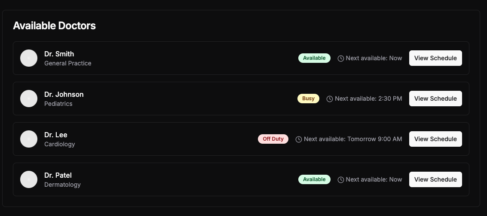
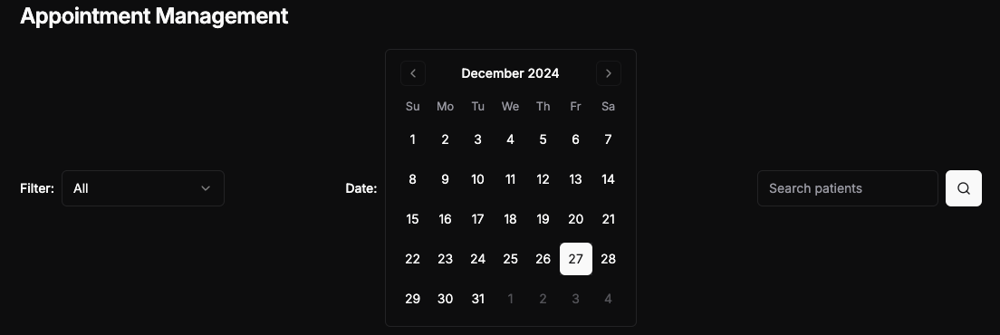
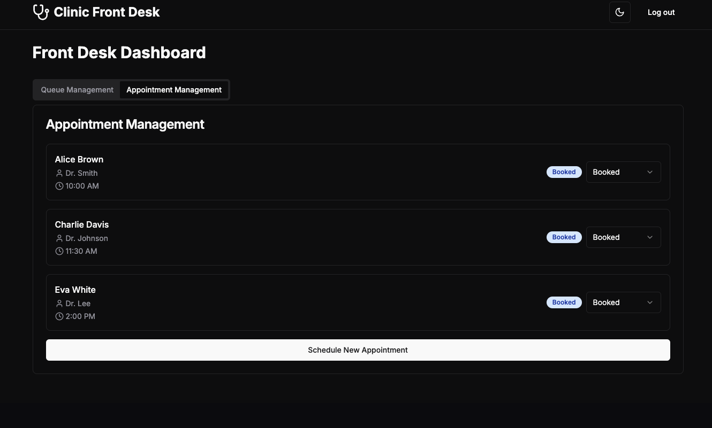
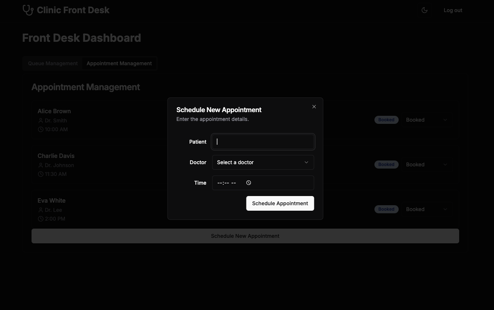

Front Desk System at a Clinic

Overview

The **Front** **Desk** **System** is a simple web-based application to
manage patient queues and doctor appointments at a clinic. The front
desk staff will be able to:

> • Manage patient queues by assigning queue numbers to walk-in
> patients.
>
> • Book, reschedule, or cancel appointments for patients.
>
> • Track patient progress in the queue and their appointment status
> with doctors.

Technology Stack

Backend:

> ● **NestJS** (Node.js framework for building scalable server-side
> applications) ● **JWT** **Authentication** (for secure login and
> authorization)
>
> ● **TypeORM** (ORM to manage MySQL database interactions)
>
> ● **MySQL** (database to store user, doctor, and appointment data)

Frontend:

> ● **React.js** (React framework for server-side rendering and static
> web pages) ● **Tailwind** **CSS** (for fast and responsive UI styling)

Roles and Responsibilities

Front Desk Staff

> ● **Manage** **Doctor** **Profiles:** Add, edit, or delete doctor
> profiles, including specialization, gender, location, and
> availability.
>
> ● **Appointment** **Management:** View, cancel, or reschedule
> appointments for all patients.
>
> ● **Search** **and** **Filter** **Doctors:** Search doctors by
> specialization, location, and availability.
>
> ● **View** **All** **Appointments:** Admin can view all appointments
> for any patient and doctor.

Key Features

**Authentication:**

> ● Implement login functionality for front desk staff to securely
> access the system.

**Queue** **Management:**

> ● Front desk staff can add walk-in patients to the queue, assign them
> queue numbers, and update their status (e.g., waiting, with doctor,
> completed).
>
> ● View and manage the queue efficiently.

**Appointment** **Management:**

> ● Front desk staff can view available doctors, book appointments,
> reschedule existing appointments, or cancel appointments if necessary.

**Appointment** **Status:**

> ● Update and track the status of appointments (booked, completed,
> canceled).

Frontend Implementation

Front Desk Page

**Queue** **Management** **Page**

> ● A list of patients in the queue, showing their queue number and
> current status.
>
> ● Options to update the status of patients (e.g., “Waiting”, “With
> Doctor”, “Completed”).

**Appointment** **Management** **View**

> ● Display available doctors and their available time slots. ● Ability
> to book, cancel, or reschedule appointments.

Bonus Features(Optional)

Deploy the Application

Deploy the application and share the live link.

Advanced Queue Features

Ability to prioritize certain patients in the queue (e.g., urgent
cases).

UI Example

This is a demo UI feel free to use your own design and maybe surprise
us.

Front Desk System

